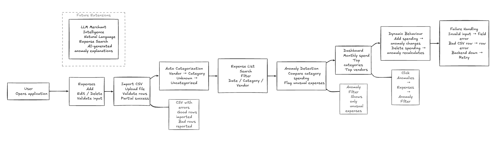
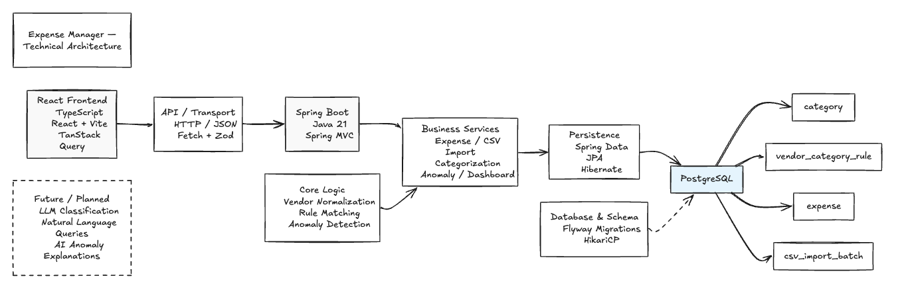

# Mini Expense Manager

A full-stack expense management application for recording, importing, categorizing, filtering, analyzing, and detecting unusual spending.

The API is organized around four core areas:

- Expenses
- CSV import
- Dashboard analytics
- Vendor categorization rules

The implementation uses React + TypeScript on the frontend and Spring Boot + PostgreSQL on the backend.

## Architecture

### Product Testing Flow

The end-to-end product journey, including the main user flows, validation, anomaly behaviour, and failure handling.



### Technical Architecture

The implementation-level flow from the React frontend through the Spring Boot services and persistence layer into PostgreSQL.



## Tech Stack

### Frontend

- TypeScript 6.0.2
- React 19.2.8
- Vite 8.2.0
- React Router 7.18.2
- TanStack Query 5.101.4
- React Hook Form
- Zod 4.4.3
- Recharts 3.10.1
- Tailwind CSS

### Backend

- Java 21
- Spring Boot 3.3.5
- Spring MVC / Tomcat
- Spring Data JPA / Hibernate
- HikariCP
- Flyway
- Apache Commons CSV
- Jackson
- Jakarta Bean Validation
- Spring Boot Actuator
- Maven

### Database

PostgreSQL 15/16-compatible schema managed by Flyway.

Main tables:

- `category`
- `vendor_category_rule`
- `expense`
- `csv_import_batch`

## Project Structure

```text
iConcile/
├── README.md
├── render.yaml
├── sample-data/
│   ├── expenses.csv
│   └── expenses-with-errors.csv
│
├── backend/
│   ├── pom.xml
│   └── src/
│       ├── main/
│       │   ├── java/com/iconcile/expense/
│       │   │   ├── config/
│       │   │   ├── domain/
│       │   │   ├── repository/
│       │   │   ├── service/
│       │   │   ├── util/
│       │   │   └── web/
│       │   │       ├── controller/
│       │   │       ├── dto/
│       │   │       └── error/
│       │   └── resources/
│       │       ├── application.yml
│       │       └── db/migration/
│       │           ├── V1__schema.sql
│       │           ├── V2__seed_categories.sql
│       │           └── V3__seed_vendor_rules.sql
│       └── test/
│
└── frontend/
    ├── package.json
    ├── vite.config.ts
    └── src/
        ├── api/
        ├── types/
        ├── hooks/
        ├── components/
        ├── features/
        │   ├── expenses/
        │   ├── import/
        │   └── dashboard/
        └── test/
```

### Main responsibilities

| Area | Responsibility |
|---|---|
| `frontend/src/features/expenses` | Expense list, filters, add/edit/delete |
| `frontend/src/features/import` | CSV upload and import results |
| `frontend/src/features/dashboard` | Dashboard cards, charts, anomaly views |
| `frontend/src/api` | API client and endpoint definitions |
| `frontend/src/types` | Zod schemas and inferred TypeScript types |
| `frontend/src/hooks` | TanStack Query hooks and cache invalidation |
| `backend/.../web` | REST controllers, DTOs, error handling |
| `backend/.../service` | Business logic, categorization, CSV import, anomaly detection, dashboard |
| `backend/.../repository` | JPA repositories and database queries |
| `backend/.../domain` | Persistence entities and enums |
| `backend/src/main/resources/db/migration` | Flyway schema and seed migrations |

## API Conventions

Base path:

```text
/api
```

Content type:

```text
application/json
```

The CSV upload endpoint uses `multipart/form-data`.

Monetary values are returned as decimal strings, for example:

```json
{
  "amount": "450.00"
}
```

Paged responses use a stable envelope:

```json
{
  "content": [],
  "page": 0,
  "size": 25,
  "totalElements": 118,
  "totalPages": 5,
  "hasNext": true
}
```

---

# 1. Expense APIs

## GET `/api/expenses`

Returns a filtered and paginated list of expenses.

### Query parameters

| Parameter | Type | Default | Description |
|---|---|---:|---|
| `from` | date | — | Inclusive lower date |
| `to` | date | — | Inclusive upper date |
| `categoryId` | number | — | Exact category match |
| `vendor` | string | — | Case-insensitive vendor search |
| `anomalyOnly` | boolean | `false` | Return only anomalies |
| `page` | number | `0` | Zero-based page |
| `size` | number | `25` | Maximum 200 |
| `sort` | string | `expenseDate,desc` | Whitelisted sort field |

Allowed sort fields:

```text
expenseDate
amount
vendorName
createdAt
anomaly
```

### Request

```http
GET /api/expenses?from=2026-07-01&to=2026-07-31&categoryId=1&anomalyOnly=false&page=0&size=2
```

### Response — `200 OK`

```json
{
  "content": [
    {
      "id": 122,
      "date": "2026-08-15",
      "amount": "222.00",
      "vendorName": "Starbucks",
      "description": null,
      "category": {
        "id": 1,
        "name": "Food",
        "colorHex": "#E76F51",
        "isDefault": false
      },
      "categorizationSource": "RULE",
      "isAnomaly": false,
      "anomalyReason": null,
      "importBatchId": null,
      "createdAt": "2026-08-14T19:24:01.159371Z"
    },
    {
      "id": 58,
      "date": "2026-08-15",
      "amount": "300.00",
      "vendorName": "Swiggy",
      "description": "Team lunch",
      "category": {
        "id": 1,
        "name": "Food",
        "colorHex": "#E76F51",
        "isDefault": false
      },
      "categorizationSource": "RULE",
      "isAnomaly": false,
      "anomalyReason": null,
      "importBatchId": null,
      "createdAt": "2026-08-14T19:04:07.060196Z"
    }
  ],
  "page": 0,
  "size": 2,
  "totalElements": 118,
  "totalPages": 59,
  "hasNext": true
}
```

---

## GET `/api/expenses/{id}`

Returns one expense.

### Request

```http
GET /api/expenses/122
```

### Response — `200 OK`

Returns the standard `Expense` object:

```json
{
  "id": 122,
  "date": "2026-08-15",
  "amount": "222.00",
  "vendorName": "Starbucks",
  "description": null,
  "category": {
    "id": 1,
    "name": "Food",
    "colorHex": "#E76F51",
    "isDefault": false
  },
  "categorizationSource": "RULE",
  "isAnomaly": false,
  "anomalyReason": null,
  "importBatchId": null,
  "createdAt": "2026-08-14T19:24:01.159371Z"
}
```

### Error

```text
404 NOT_FOUND
```

---

## POST `/api/expenses`

Creates an expense.

### Request

```json
{
  "date": "2026-08-01",
  "amount": "450.00",
  "vendorName": "Swiggy",
  "description": "Team lunch",
  "categoryId": null
}
```

When `categoryId` is omitted or `null`, the vendor categorization rules are used.

### Validation

- `date` required, `yyyy-MM-dd`, not future
- `amount > 0`
- maximum 2 decimal places
- maximum amount `10000000.00`
- `vendorName` required, 1–120 characters after trim
- `description` optional, maximum 500 characters
- supplied `categoryId` must exist

### Response — `201 Created`

```json
{
  "id": 1,
  "date": "2026-08-01",
  "amount": "450.00",
  "vendorName": "Swiggy",
  "description": "Team lunch",
  "category": {
    "id": 1,
    "name": "Food",
    "colorHex": "#E76F51",
    "isDefault": false
  },
  "categorizationSource": "RULE",
  "isAnomaly": false,
  "anomalyReason": null,
  "importBatchId": null,
  "createdAt": "2026-08-01T10:12:03.397102Z"
}
```

The create operation also normalizes the vendor name, resolves the category, and re-evaluates the affected category for anomalies before returning.

---

## PUT `/api/expenses/{id}`

Full replacement update.

### Request

Same body and validation rules as `POST /api/expenses`.

```json
{
  "date": "2026-08-01",
  "amount": "500.00",
  "vendorName": "Swiggy",
  "description": "Team lunch",
  "categoryId": null
}
```

### Response — `200 OK`

Returns the updated `Expense` object.

### Side effects

The previous and new categories are re-evaluated because changing an amount or category can affect anomalies in both categories.

### Errors

```text
404 NOT_FOUND
```

when the expense or supplied category does not exist.

---

## DELETE `/api/expenses/{id}`

Deletes an expense.

### Request

```http
DELETE /api/expenses/122
```

### Response

```text
204 No Content
```

The deleted expense's category is re-evaluated for anomalies.

### Error

```text
404 NOT_FOUND
```

---

# 2. CSV Import APIs

## POST `/api/expenses/import`

Uploads a CSV file and imports valid rows.

### Request

```http
POST /api/expenses/import
Content-Type: multipart/form-data
```

Form field:

```text
file
```

Limits:

- Maximum 5 MB
- Maximum 10,000 data rows

Example CSV:

```csv
date,amount,vendor,description
2026-08-01,450.00,Swiggy,Team lunch
```

### Response — clean file

```json
{
  "batchId": 1,
  "filename": "expenses.csv",
  "totalRows": 56,
  "importedRows": 56,
  "failedRows": 0,
  "status": "COMPLETED",
  "errors": [],
  "warnings": []
}
```

### Response — file with row errors

```json
{
  "batchId": 2,
  "filename": "expenses-with-errors.csv",
  "totalRows": 10,
  "importedRows": 4,
  "failedRows": 6,
  "status": "COMPLETED_WITH_ERRORS",
  "errors": [
    {
      "row": 5,
      "field": "date",
      "message": "Date '2026-06-18' is not a valid date in the format dd/MM/yyyy locked by the first row of this file"
    },
    {
      "row": 6,
      "field": "amount",
      "message": "Not a valid number: 'abc'"
    },
    {
      "row": 7,
      "field": "amount",
      "message": "Amount must be greater than 0, got '-99.00'"
    },
    {
      "row": 8,
      "field": "date",
      "message": "Date '31/02/2026' is not a valid date in the format dd/MM/yyyy locked by the first row of this file"
    },
    {
      "row": 9,
      "field": "vendor",
      "message": "Vendor name is required"
    },
    {
      "row": 10,
      "field": "amount",
      "message": "Amount '99.999' has more than 2 decimal places"
    }
  ],
  "warnings": [
    {
      "row": 4,
      "message": "Matches an expense already on file (Swiggy, 2026-06-15)"
    }
  ]
}
```

Bad rows are reported and skipped; valid rows still import.

### Other responses

Missing required CSV column:

```text
422 CSV_UNPROCESSABLE
```

Example:

```json
{
  "timestamp": "2026-08-13T09:31:02.113Z",
  "status": 422,
  "error": "CSV_UNPROCESSABLE",
  "message": "Missing required column(s): amount (accepted: amount, debit, price, spend, value). Found header: date, description",
  "path": "/api/expenses/import"
}
```

File too large:

```text
413 FILE_TOO_LARGE
```

---

## GET `/api/expenses/import/format`

Returns the parser's own configuration so the UI stays aligned with the backend.

### Request

```http
GET /api/expenses/import/format
```

### Response — `200 OK`

```json
{
  "templateHeader": "date,amount,vendor,description",
  "acceptedDateFormats": [
    "yyyy-MM-dd",
    "dd/MM/yyyy",
    "dd-MM-yyyy",
    "yyyy/MM/dd"
  ],
  "requiredColumns": [
    "date",
    "amount",
    "vendor"
  ],
  "optionalColumns": [
    "description",
    "category"
  ],
  "columnAliases": {
    "DATE": [
      "date",
      "expensedate",
      "transactiondate",
      "txndate",
      "valuedate"
    ],
    "AMOUNT": [
      "amount",
      "debit",
      "price",
      "spend",
      "value"
    ],
    "VENDOR": [
      "merchant",
      "merchantname",
      "payee",
      "vendor",
      "vendorname"
    ],
    "DESCRIPTION": [
      "description",
      "memo",
      "narration",
      "note",
      "notes",
      "particulars",
      "remarks"
    ],
    "CATEGORY": [
      "category",
      "categoryname"
    ]
  }
}
```

---

# 3. Dashboard APIs

## GET `/api/dashboard/summary`

Returns headline dashboard metrics.

### Query parameter

```text
month=yyyy-MM
```

If omitted, the result is all-time.

### Request

```http
GET /api/dashboard/summary?month=2026-08
```

### Response — `200 OK`

```json
{
  "month": "2026-08",
  "totalAmount": "38578.00",
  "expenseCount": 26,
  "anomalyCount": 2,
  "topCategoryName": "Food",
  "topCategoryAmount": "21972.00"
}
```

An empty month returns zero amounts/counts and `null` category fields.

---

## GET `/api/dashboard/monthly-by-category`

Returns stacked-bar chart data.

### Query parameters

| Parameter | Type | Default |
|---|---|---|
| `from` | `yyyy-MM` | 5 months before `to` |
| `to` | `yyyy-MM` | current month |

Maximum range: 60 months.

### Request

```http
GET /api/dashboard/monthly-by-category?from=2026-06&to=2026-08
```

### Response — `200 OK`

```json
{
  "months": [
    "2026-06",
    "2026-07",
    "2026-08"
  ],
  "series": [
    {
      "categoryId": 7,
      "categoryName": "Health",
      "colorHex": "#F15BB5",
      "totals": [
        "1780.00",
        "31600.00",
        "1440.00"
      ]
    },
    {
      "categoryId": 3,
      "categoryName": "Travel",
      "colorHex": "#264653",
      "totals": [
        "26590.00",
        "4910.00",
        "1350.00"
      ]
    }
  ]
}
```

The server generates the complete month range, including zero-value months, so chart indexes always stay aligned.

---

## GET `/api/dashboard/top-vendors`

Returns top vendors by spend.

### Query parameters

| Parameter | Type | Default |
|---|---|---:|
| `month` | `yyyy-MM` | all time |
| `limit` | number | `5` |

`limit` must be between 1 and 50.

### Request

```http
GET /api/dashboard/top-vendors?month=2026-08&limit=5
```

### Response — `200 OK`

```json
{
  "vendors": [
    {
      "vendorName": "Apollo Hospital",
      "totalAmount": "31600.00",
      "expenseCount": 2,
      "topCategory": "Health"
    },
    {
      "vendorName": "MakeMyTrip",
      "totalAmount": "29200.00",
      "expenseCount": 4,
      "topCategory": "Travel"
    }
  ]
}
```

Vendor grouping uses `vendor_normalized`, so casing and punctuation variants collapse into the same vendor group.

---

## GET `/api/dashboard/anomalies`

Returns anomalous expenses with their calculated baseline.

### Query parameters

| Parameter | Type | Default |
|---|---|---:|
| `page` | number | `0` |
| `size` | number | `20` |

Maximum page size: 200.

This endpoint is all-time and sorted by amount descending.

### Request

```http
GET /api/dashboard/anomalies?page=0&size=20
```

### Response — `200 OK`

```json
{
  "content": [
    {
      "expense": {
        "id": 100,
        "date": "2026-07-26",
        "amount": "15800.00",
        "vendorName": "Apollo Hospital",
        "description": "Dental procedure",
        "category": {
          "id": 7,
          "name": "Health",
          "colorHex": "#F15BB5",
          "isDefault": false
        },
        "categorizationSource": "RULE",
        "isAnomaly": true,
        "anomalyReason": "AMOUNT_GT_3X_CATEGORY_AVG",
        "importBatchId": 2,
        "createdAt": "2026-08-14T19:13:34.908529Z"
      },
      "categoryAverage": "2900.00",
      "threshold": "8700.00",
      "timesAverage": "5.45"
    }
  ],
  "page": 0,
  "size": 1,
  "totalElements": 6,
  "totalPages": 6,
  "hasNext": true
}
```

---

# 4. Category APIs

## GET `/api/categories`

Returns all categories ordered by name.

### Request

```http
GET /api/categories
```

### Response — `200 OK`

```json
[
  {
    "id": 6,
    "name": "Entertainment",
    "colorHex": "#9B5DE5",
    "isDefault": false
  },
  {
    "id": 1,
    "name": "Food",
    "colorHex": "#E76F51",
    "isDefault": false
  },
  {
    "id": 2,
    "name": "Groceries",
    "colorHex": "#2A9D8F",
    "isDefault": false
  },
  {
    "id": 7,
    "name": "Health",
    "colorHex": "#F15BB5",
    "isDefault": false
  },
  {
    "id": 4,
    "name": "Shopping",
    "colorHex": "#E9C46A",
    "isDefault": false
  },
  {
    "id": 3,
    "name": "Travel",
    "colorHex": "#264653",
    "isDefault": false
  },
  {
    "id": 8,
    "name": "Uncategorized",
    "colorHex": "#8D99AE",
    "isDefault": true
  },
  {
    "id": 5,
    "name": "Utilities",
    "colorHex": "#8AB17D",
    "isDefault": false
  }
]
```

---

# 5. Vendor Rule APIs

Vendor rules are data-driven rather than hard-coded.

Matching happens against the normalized vendor name.

## GET `/api/vendor-rules`

Returns active rules first, then by priority.

### Request

```http
GET /api/vendor-rules
```

### Response — `200 OK`

```json
[
  {
    "id": 23,
    "pattern": "swiggy instamart",
    "matchType": "CONTAINS",
    "category": {
      "id": 2,
      "name": "Groceries",
      "colorHex": "#2A9D8F",
      "isDefault": false
    },
    "priority": 5,
    "active": true
  }
]
```

---

## POST `/api/vendor-rules`

Creates a categorization rule.

### Request

```json
{
  "pattern": "Chai Point",
  "matchType": "CONTAINS",
  "categoryId": 1,
  "priority": 100
}
```

### Validation

- `pattern` required, maximum 120 characters
- `matchType`: `EXACT` or `CONTAINS`
- `categoryId` must exist
- `priority`: 1–1000, default 100
- `active`: optional, default `true`

### Response — `201 Created`

```json
{
  "id": 69,
  "pattern": "chai point",
  "matchType": "CONTAINS",
  "category": {
    "id": 1,
    "name": "Food",
    "colorHex": "#E76F51",
    "isDefault": false
  },
  "priority": 100,
  "active": true
}
```

The pattern is normalized before storage and the in-memory rule cache is refreshed immediately.

### Duplicate rule

```text
400 BAD_REQUEST
```

---

## PUT `/api/vendor-rules/{id}`

Updates an existing rule.

### Request

Same shape as `POST /api/vendor-rules`.

### Response

```text
200 OK
```

Returns the updated rule.

---

## DELETE `/api/vendor-rules/{id}`

Deactivates a rule rather than physically deleting it.

### Request

```http
DELETE /api/vendor-rules/69
```

### Response

```text
204 No Content
```

---

# 6. Health API

## GET `/actuator/health`

Spring Boot Actuator liveness endpoint.

### Request

```http
GET /actuator/health
```

### Response

The standard Spring Boot Actuator health response.

---

# 7. Shared Error Contract

Application errors use a consistent JSON shape.

### Validation example

```json
{
  "timestamp": "2026-08-13T09:22:11.482+05:30",
  "status": 400,
  "error": "VALIDATION_FAILED",
  "message": "Request validation failed",
  "path": "/api/expenses",
  "fieldErrors": [
    {
      "field": "amount",
      "message": "Amount must be greater than 0"
    }
  ]
}
```

### Error codes

| Status | Error | Meaning |
|---:|---|---|
| 400 | `VALIDATION_FAILED` | Request-body validation failed |
| 400 | `BAD_REQUEST` | Invalid argument, bad sort key, duplicate rule, etc. |
| 400 | `MALFORMED_REQUEST` | Malformed JSON or request structure |
| 404 | `NOT_FOUND` | Expense, category, or rule not found |
| 413 | `FILE_TOO_LARGE` | CSV exceeds upload limit |
| 422 | `CSV_UNPROCESSABLE` | Invalid CSV structure or missing required column |
| 500 | `INTERNAL_ERROR` | Unhandled server error |

---

# 8. Core Processing Rules

## Vendor categorization

The categorization pipeline is:

```text
Raw vendor name
    ↓
Normalize
    ↓
EXACT match
    ↓
CONTAINS match by priority
    ↓
Fallback → Uncategorized
```

Examples:

```text
uber eats          → Food
swiggy instamart   → Groceries
amazon prime video → Entertainment
coca cola          → Uncategorized
```

Rules are cached in memory and refreshed when a rule changes.

An explicit `categoryId` on an expense bypasses automatic categorization and is stored as:

```text
MANUAL_OVERRIDE
```

## Anomaly detection

An expense is flagged when:

```text
amount > 3 × average(other expenses in the same category)
```

The implementation uses:

- leave-one-out averages
- minimum sample size of 3 other expenses
- stored anomaly flags
- category re-sweeps after writes

## CSV import

The importer:

1. validates the file
2. resolves column aliases
3. parses each row
4. validates the row
5. categorizes it
6. inserts valid rows in batches
7. reports row-level failures
8. updates anomaly state

Malformed rows do not discard otherwise valid rows.

---

# 9. Design Decisions

### Money is decimal-safe

Money uses:

```text
Java BigDecimal
PostgreSQL NUMERIC(14,2)
JSON decimal strings
```

No floating-point arithmetic is used for monetary values.

### Database schema is migration-owned

Flyway owns schema creation and seed data.

Hibernate runs in validation mode rather than modifying the schema.

### Runtime API validation

Zod validates API responses on the frontend so backend contract changes become explicit transport errors.

### Server-state driven frontend

TanStack Query is used as the source of truth for server data rather than maintaining a second client-side store.

### Stable pagination contract

The API returns an explicit page envelope rather than exposing Spring's internal `PageImpl` JSON structure.

---

# 10. Quick Start

### Prerequisites

- Java 21
- Maven 3.9+
- Node.js 20+
- PostgreSQL running locally

### 1. Start PostgreSQL

The backend expects PostgreSQL on `localhost:5432` by default.

Create the application and test databases if they do not already exist:

```bash
psql -d postgres -c "CREATE ROLE postgres LOGIN SUPERUSER PASSWORD 'postgres';"
psql -d postgres -c "CREATE DATABASE expenses OWNER postgres;"
psql -d postgres -c "CREATE DATABASE expenses_test OWNER postgres;"
```

If the `postgres` role or databases already exist, skip the commands that are not needed.

No manual table creation is required. Flyway creates the schema and seeds categories and vendor rules when the backend starts.

### 2. Start the backend

From the project root:

```bash
cd backend
mvn spring-boot:run
```

Backend:

```text
http://localhost:8080
```

### 3. Start the frontend

Open a second terminal:

```bash
cd frontend
npm install
npm run dev
```

Frontend:

```text
http://localhost:5173
```

The Vite development server proxies `/api` requests to the backend on port `8080`.

### Start both quickly

```bash
# Terminal 1
cd backend && mvn spring-boot:run

# Terminal 2
cd frontend && npm install && npm run dev
```

Then open:

```text
http://localhost:5173
```

### Optional: run tests

Backend:

```bash
cd backend
mvn test
```

Unit tests only:

```bash
mvn test -DskipITs
```

Frontend:

```bash
cd frontend
npm test
npm run typecheck
```
